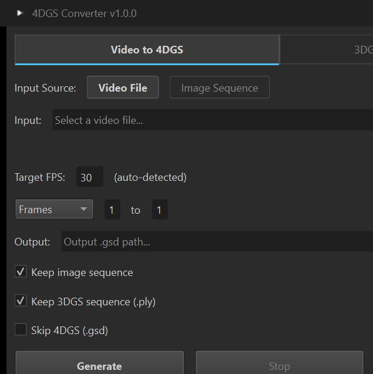

<p align="center">
  
  <h1 align="center">4DGS Converter</h1>
  <p align="center">Convert videos or 3DGS (.ply) sequences into 4DGS (.gsd) files for real-time Gaussian Splatting playback.</p>
  <p align="center">
    
    
    
    <a href="https://github.com/DazaiStudio/4dgs-converter/releases"></a>
  </p>
</p>



## Table of Contents

- [Features](#features)
- [Download](#download)
- [What is 4DGS?](#what-is-4dgs)
- [Unreal Engine Plugin](#unreal-engine-plugin)
- [Pipeline](#pipeline)
- [Installation](#installation)
- [Usage](#usage)
- [GSD Format](#gsd-format)
- [License](#license)

---

## Features

- **GUI** — One-click conversion with visual controls for FPS, frame range, and mode selection
- **CLI** — Command-line interface for scripting and AI agent integration (Claude, GPT, etc.)
- **Format Support** — Works with any standard 3DGS `.ply` format (SHARP, PostShot, Nerfstudio, etc.)

---

## Download

| Platform | File |
|----------|------|
| Windows  | [**4DGS-Converter.exe**](https://github.com/DazaiStudio/4dgs-converter/releases/latest) |
| macOS    | Run from source (see below) |

---

## What is 4DGS?

**4D Gaussian Splatting** extends 3D Gaussian Splatting with a time dimension, enabling real-time playback of dynamic 3D scenes. The `.gsd` (Gaussian Stream Data) format stores compressed frame sequences for real-time playback in game engines.

---

## Unreal Engine Plugin

**Splat Renderer** — UE 5.6 plugin for real-time `.gsd` playback. *Coming soon.*

## Pipeline

```
Video ──► Images (ffmpeg) ──► 3DGS .ply (SHARP) ──► 4DGS .gsd
                                                      ▲
              3DGS Sequence (.ply) folder ────────────┘
```

## Installation

```bash
git clone https://github.com/DazaiStudio/4dgs-converter.git
cd 4dgs-converter
pip install -r requirements.txt
pip install PySide6 lz4
```

## Dependencies

| Tool | Required For | Install |
|------|-------------|---------|
| **ffmpeg** | Video frame extraction | `winget install ffmpeg` (Win) / `brew install ffmpeg` (Mac) |
| **SHARP** (ml-sharp) | Video → 3DGS | [apple/ml-sharp](https://github.com/apple/ml-sharp) |
| **lz4** | GSD compression | `pip install lz4` |

> ffmpeg and SHARP are only needed for **Video → 4DGS** mode. For **3DGS Sequence → 4DGS**, only lz4 is required.

## Usage

### GUI

```bash
python -m app.converter
```

1. Select mode: **Video to 4DGS** or **3DGS Sequence to 4DGS**
2. Browse for input (video file or 3DGS sequence (.ply) folder)
3. Adjust FPS and frame range if needed
4. Click **Generate**

### CLI

```bash
# Video to GSD (full pipeline)
python -m app.converter --cli -i video.mp4 -o output.gsd

# 3DGS sequence (.ply) folder to GSD
python -m app.converter --cli -i /path/to/ply_folder -o output.gsd --fps 24

# With options
python -m app.converter --cli -i video.mp4 --start 0 --end 100 --keep-ply --keep-images
```

| Flag | Description |
|------|-------------|
| `--cli` | Run in CLI mode (no GUI) |
| `-i, --input` | Input video file or 3DGS sequence (.ply) folder |
| `-o, --output` | Output .gsd path (auto-derived if omitted) |
| `--mode` | `auto`, `video`, or `ply` (default: auto-detect) |
| `--fps` | Target FPS (default: 30, auto-detected for video) |
| `--start` | Start frame, 0-based (default: 0) |
| `--end` | End frame, 0-based (default: last) |
| `--keep-images` | Keep extracted images (video mode) |
| `--keep-ply` | Keep PLY files (video mode) |
| `--skip-gsd` | Stop after PLY generation (video mode) |

## GSD Format

Single-file format: `magic("GSD1") + header_size(u32) + JSON_header + frame_blobs`

Each frame blob is independently LZ4-compressed with byte-shuffle preprocessing:

```
Per-texture: pixels reshaped to (N, bytes_per_pixel), transposed, flattened
All textures concatenated → LZ4 block compress
```

Textures per frame (15 total): position, rotation, scaleOpacity, sh_0 .. sh_11

## Build Executable

```bash
pip install pyinstaller
pyinstaller 4dgs_converter.spec
```

Output: `dist/4DGS-Converter.exe` (Windows) or `dist/4DGS-Converter.app` (macOS)

## Project Structure

```
app/
  converter/          # PySide6 GUI
    main_window.py    # Main window UI
    worker.py         # Background pipeline thread
    env_check.py      # Dependency checker
  pipeline/           # Conversion modules
    video_to_images.py
    images_to_ply.py
    ply_to_gsd.py
    ply_to_raw.py
    raw_to_gsd.py
```

## License

MIT
