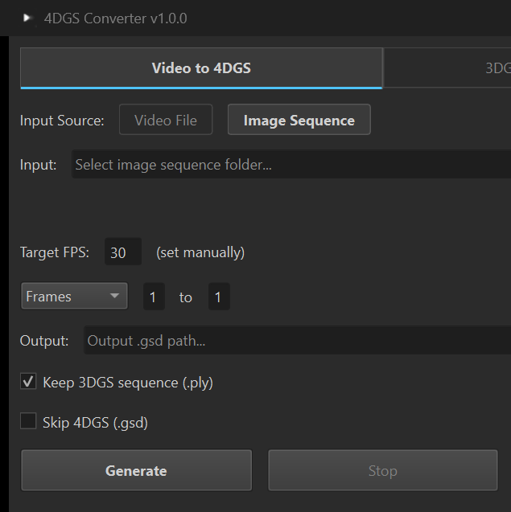

<p align="center">
  
  <h1 align="center">4DGS Converter</h1>
  <p align="center">Convert videos, image sequences, or 3DGS (.ply) sequences into 4DGS (.gsd) files for real-time Gaussian Splatting playback.</p>
  <p align="center">
    
    
    
    <a href="https://github.com/DazaiStudio/4dgs-converter/releases"></a>
  </p>
</p>


## Table of Contents

- [Features](#features)
- [Getting Started](#getting-started)
- [How It Works](#how-it-works)
- [How to Use](#how-to-use)
- [Reference](#reference)
- [License](#license)

---

## Features

- **3 Input Modes** : Video (.mp4/.mov/.avi/.mkv), Image Sequence (.jpg/.png/.heic), or 3DGS Sequence (.ply)
- **GSD v2 (SHARP-VQ)** : New compression format — ~78% smaller than v1 using per-frame vector quantization
- **GUI** : Dark-themed interface with one-click SHARP install, dependency status, and visual controls
- **CLI** : Command-line interface for scripting and AI agent integration (Claude, GPT, etc.)
- **Format Support** : Works with any standard 3DGS `.ply` format (SHARP, PostShot, Nerfstudio, etc.)

---

## Getting Started

### Option A: Download (Windows)

Download [**4DGS-Converter.exe**](https://github.com/DazaiStudio/4dgs-converter/releases/latest) and run. No installation required.

### Option B: Run from Source (Windows / macOS)

```bash
git clone https://github.com/DazaiStudio/4dgs-converter.git
cd 4dgs-converter
pip install -r requirements.txt
pip install PySide6 lz4 scikit-learn
python -m app.converter
```

---

## How It Works

```
Video ──────────► Images (ffmpeg) ──► 3DGS .ply (SHARP) ──► 4DGS .gsd
Image Sequence ──────────────────► 3DGS .ply (SHARP) ──► 4DGS .gsd
                                                            ▲
                    3DGS Sequence (.ply) folder ───────────┘
```

---

## How to Use

### GUI

1. Select mode: **Video to 4DGS**, **Image Sequence to 4DGS**, or **3DGS Sequence to 4DGS**
2. Browse for input (video file, image folder, or 3DGS sequence folder)
3. Adjust FPS and frame range if needed
4. Click **Generate**

 

### CLI

```bash
# Video to GSD (full pipeline)
python -m app.converter --cli -i video.mp4 -o output.gsd

# Image sequence to GSD
python -m app.converter --cli -i /path/to/images -o output.gsd --mode images --fps 30

# 3DGS sequence (.ply) folder to GSD
python -m app.converter --cli -i /path/to/ply_folder -o output.gsd --fps 24

# With options
python -m app.converter --cli -i video.mp4 --start 0 --end 100 --keep-ply --keep-images
```

---

## Reference

<details>
<summary><strong>GSD Format</strong></summary>

**4D Gaussian Splatting** extends 3DGS with a time dimension, enabling real-time playback of dynamic 3D scenes.

The `.gsd` (Gaussian Stream Data) format packs an entire PLY sequence into a single compressed file, with O(1) random access to any frame.

| Version | Compression | Typical Size | Notes |
|---------|------------|-------------|-------|
| **v1** | Byte-Shuffle + LZ4 | ~64% of raw | Fast, every frame independent |
| **v2** | SHARP-VQ (per-frame VQ + LZ4) | ~22% of raw | 73% smaller than v1, designed for SHARP output |

**Example (1.18M gaussians, SH0, per frame):**
- Raw: ~47 MB &rarr; GSD v1: ~30 MB &rarr; GSD v2: ~8 MB

</details>

<details>
<summary><strong>CLI Flags</strong></summary>

| Flag | Description |
|------|-------------|
| `--cli` | Run in CLI mode (no GUI) |
| `-i, --input` | Input video file, image folder, or 3DGS sequence (.ply) folder |
| `-o, --output` | Output .gsd path (auto-derived if omitted) |
| `--mode` | `auto`, `video`, `images`, or `ply` (default: auto-detect) |
| `--fps` | Target FPS (default: 30, auto-detected for video) |
| `--start` | Start frame, 0-based (default: 0) |
| `--end` | End frame, 0-based (default: last) |
| `--keep-images` | Keep extracted images (video mode) |
| `--keep-ply` | Keep PLY files (video/images mode) |
| `--skip-gsd` | Stop after PLY generation (video/images mode) |

</details>

<details>
<summary><strong>Dependencies</strong></summary>

| Tool | Required For | Install |
|------|-------------|---------|
| **ffmpeg** | Video frame extraction | `winget install ffmpeg` (Win) / `brew install ffmpeg` (Mac) |
| **SHARP** (ml-sharp) | Video/Images → 3DGS | [apple/ml-sharp](https://github.com/apple/ml-sharp) — or click **Install** in the GUI |
| **lz4** | GSD compression | `pip install lz4` |
| **scikit-learn** | GSD v2 (VQ encoding) | `pip install scikit-learn` |

ffmpeg and SHARP are only needed for **Video/Images → 4DGS** mode. For **3DGS Sequence → 4DGS**, only lz4 is required.

</details>

<details>
<summary><strong>Unreal Engine Plugin</strong></summary>

**Splat Renderer** : UE 5.6 plugin for real-time `.gsd` playback. *Coming soon.*

</details>

---

## License

MIT
